+ Adam_betas=[0.9,0.999]
+ 网络结构，8个残差模块儿，16+1+2层结构&emsp;batch_size=64,lr=5e-4,Adam,acc=84%
+ batch_size=128,lr=5e-4,Adam,acc=83.6%,epochs=17
+ batch_size=128,lr=0.1,SGD,RandomCrop+RandomHorizontalFlip,acc=82.9%,epochs=15 (振荡比较明显)
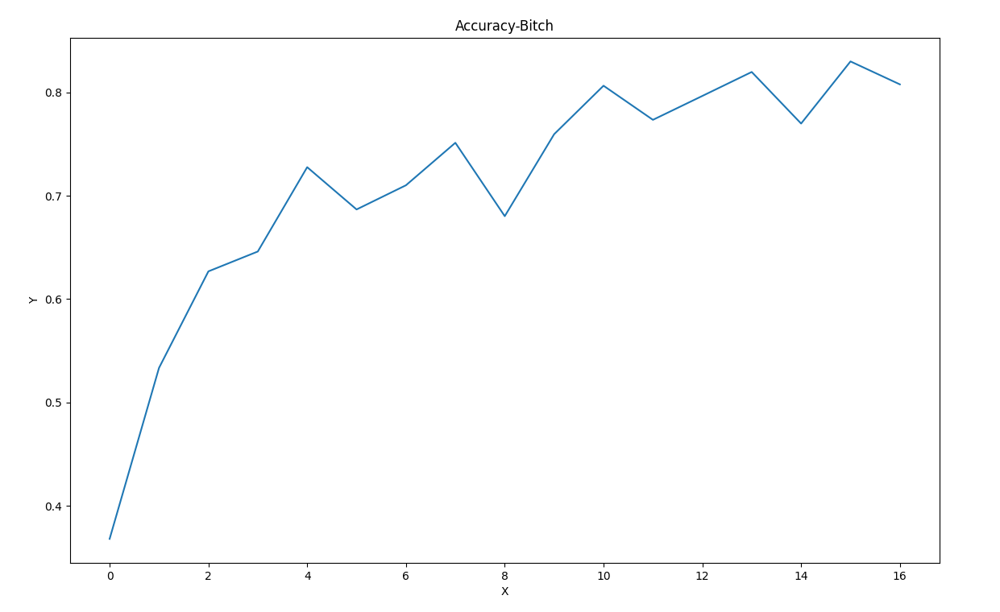
+ batch_size=128,lr=0.01,SGD,RandomCrop+RandomHorizontalFlip,acc=88.6%,epochs=17
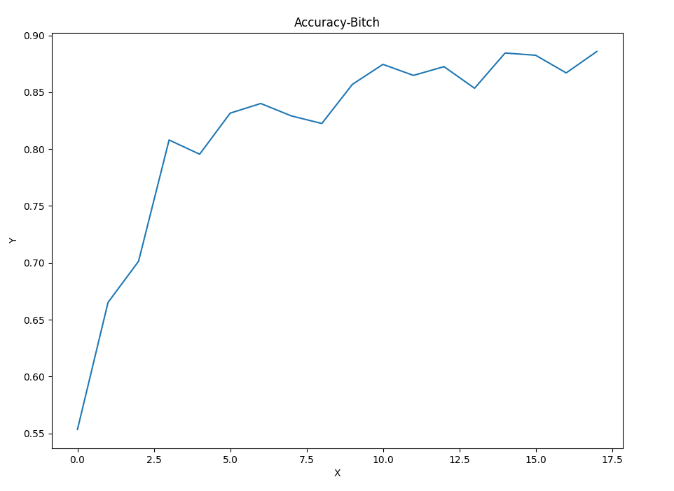
+ batch_size=128,lr=0.05,SGD,RandomCrop+RandomHorizontalFlip,acc=84.5%,epochs=17
+ batch_size=128,lr=0.0005,Adam,RandomCrop+RandomHorizontalFlip,acc=89.6%,epochs=20
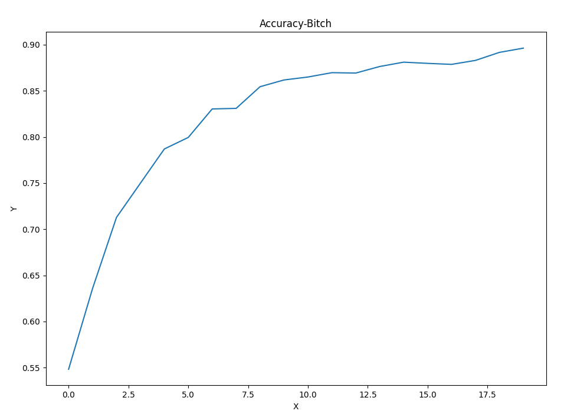
+ batch_size=128,lr=0.001,Adam,RandomCrop+RandomHorizontalFlip,acc=88.6%,epochs=20
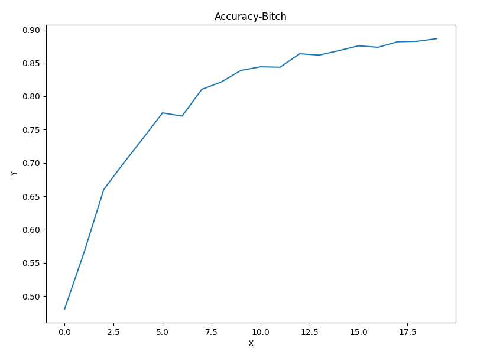
+ batch_size=128,lr=0.0005,Adam,RandomCrop+RandomHorizontalFlip,acc=90.7%,epochs=30
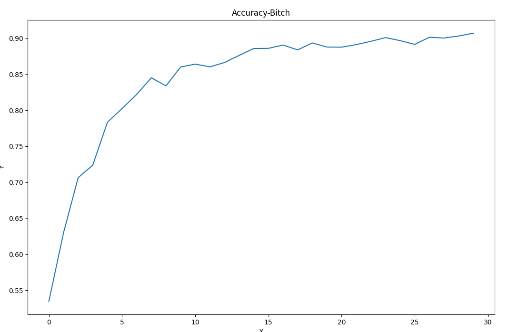
+ batch_size=128,lr=0.0005,Adam,RandomCrop+RandomHorizontalFlip,acc=92.5%,epochs=64
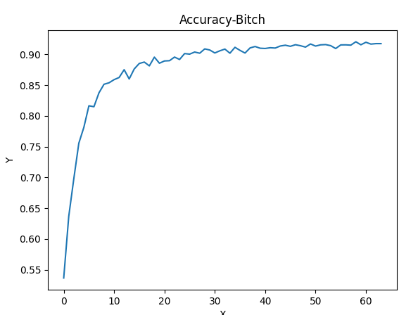
+ batch_size=128,lr=0.0005-0.05,SGD_cos_5,RandomCrop+RandomHorizontalFlip,acc=93.9%,epochs=64
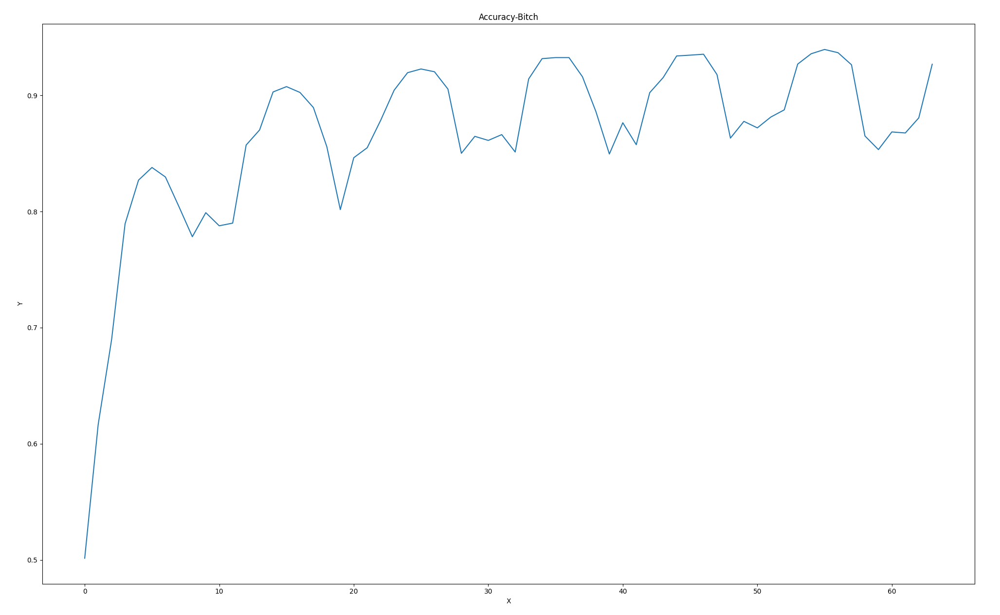
+ batch_size=128,lr=0.0005-0.02,SGD_cos_5,RandomCrop+RandomHorizontalFlip,acc=93.9%,epochs=64（同样有明显振荡，因此应该把初始学习率调小）
+  batch_size=128,lr=0.0005-0.005,SGD_cos_5,RandomCrop+RandomHorizontalFlip,acc=92.5%,epochs=64（同样有明显振荡，尝试使用Adam）
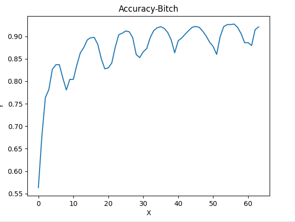
+  batch_size=128,lr=0.0005-0.005,Adam_cos_5,RandomCrop+RandomHorizontalFlip,acc=91.8%,epochs=64(没有SGD和单纯Adam好，尝试调整lr区间，绘制lr和acc曲线)
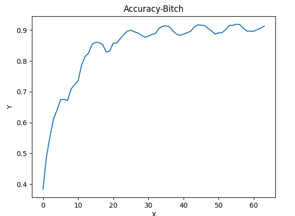
+  batch_size=128,lr=0.0005-0.005,Adam_cos_5_betas=0.9,RandomCrop+RandomHorizontalFlip,acc=92.87%,epochs=64(没有SGD和单纯Adam好，尝试调整lr区间，绘制lr和acc曲线)
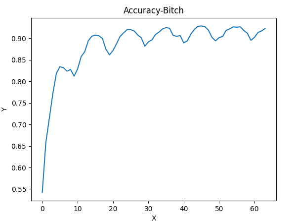
+  batch_size=128,lr=0.0005-0.001,Adam_cos_5_betas=0.9,RandomCrop+RandomHorizontalFlip,acc=92.3%,epochs=64(振荡幅度变小了，但是最大值也变小)
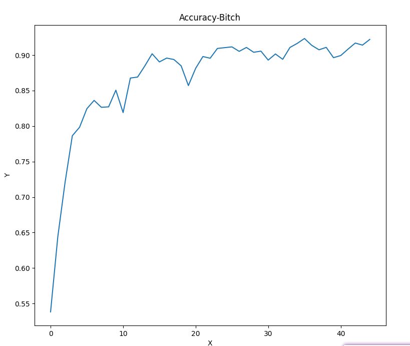
+  batch_size=128,lr=0.005-0.01,SGD_cos_5_betas=0.9,RandomCrop+RandomHorizontalFlip,acc=91.8%,epochs=64(振荡幅度变小了，但是最大值也变小)
+  batch_size=128,lr=0.005-0.05,SGD_cos_5_betas=0.9,RandomCrop+RandomHorizontalFlip,acc=92%,epochs=24(效果不好，振荡太大)
+  batch_size=128,lr=0.005-0.03,SGD_cos_5_betas=0.9,RandomCrop+RandomHorizontalFlip,acc=93.2%,epochs=45(振荡,但峰值很高)
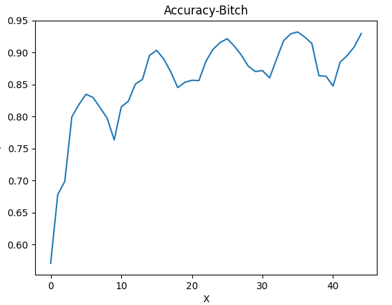
+  batch_size=128,lr=0.005-0.03,SGD_cos_10_betas=0.9,RandomCrop+RandomHorizontalFlip,acc=93.6%,epochs=64(振荡周期变长,但峰值很高)
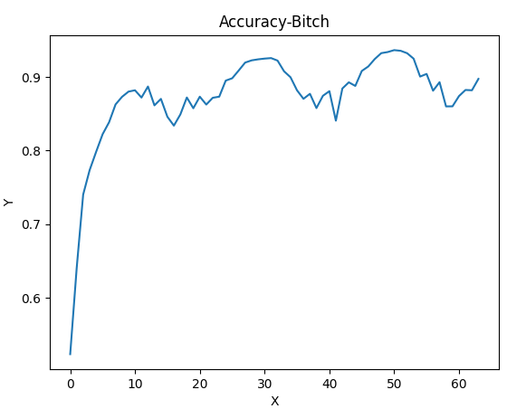
+  batch_size=128,lr=0.005-0.03,SGD_cos_32_betas=0.9,RandomCrop+RandomHorizontalFlip,acc=92.7%,epochs=64(振荡周期变长,但峰值很高)
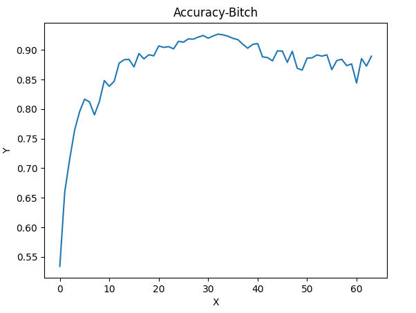
+  batch_size=128,lr=0.005-0.03,SGD_cos_64_betas=0.9,RandomCrop+RandomHorizontalFlip,acc=93.6%,epochs=64(非常完美，且仍有上升趋势) 
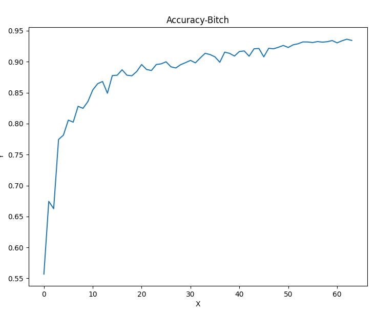